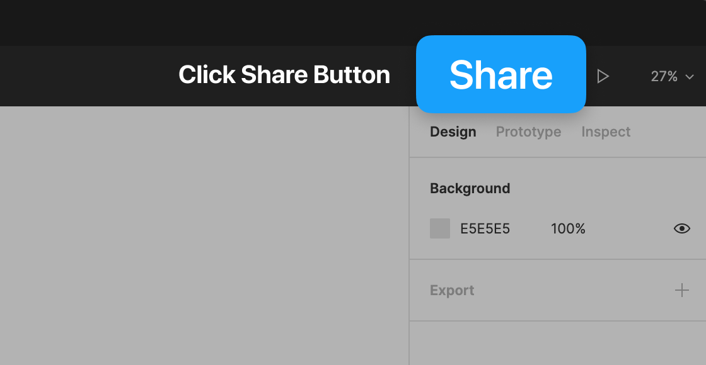
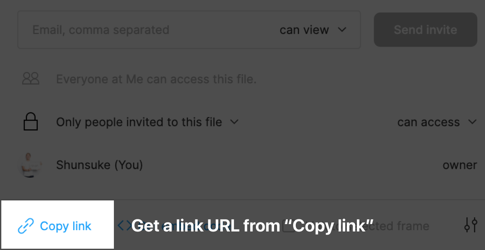
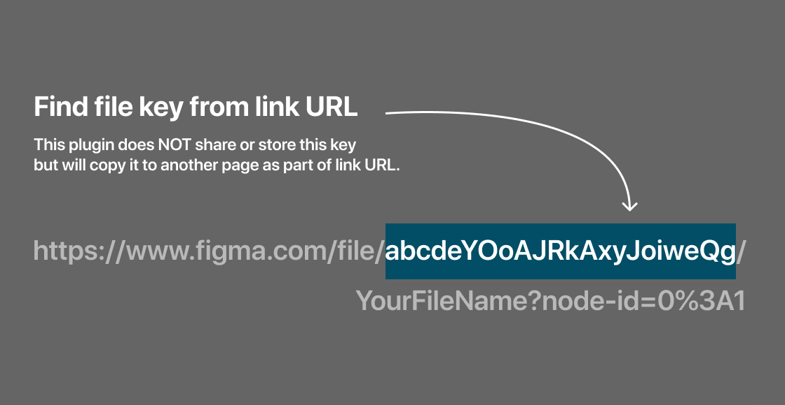

# Screen Name Export (Figma Plugin)

Export selected frame name and link URL to another page in the current file.

[Install plugin](https://www.figma.com/community/plugin/970942453220570484/Screen-Name-Export)

- Select frames you want to export the name to.
- Execute this plugin and enter your file key.
- You will have a new page named "Screen Name ${DateTime}".

### What is file key?

You can find it in a shared link URL.

`abcdefghigk1234567890` is the file key in an example below.
> `https://www.figma.com/file/abcdefghigk1234567890/FileName?node-id=2089%3A25262`
